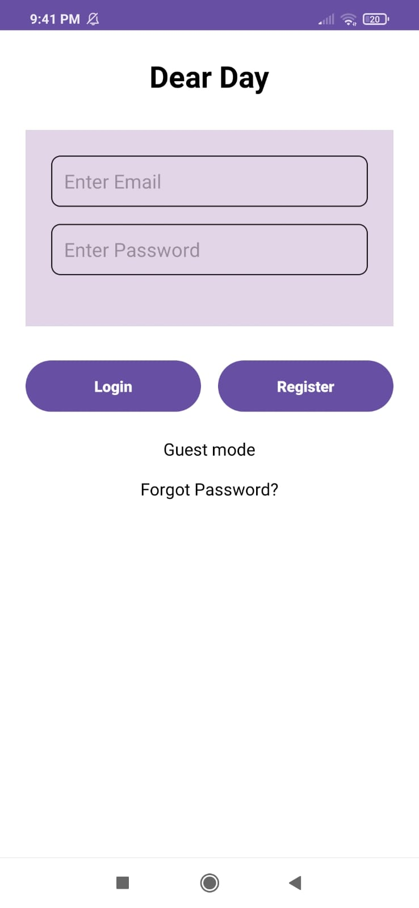
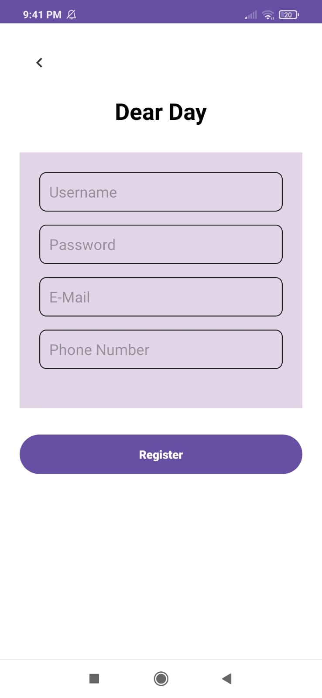
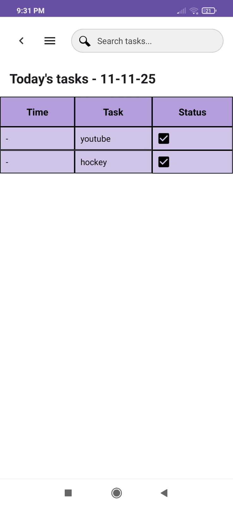
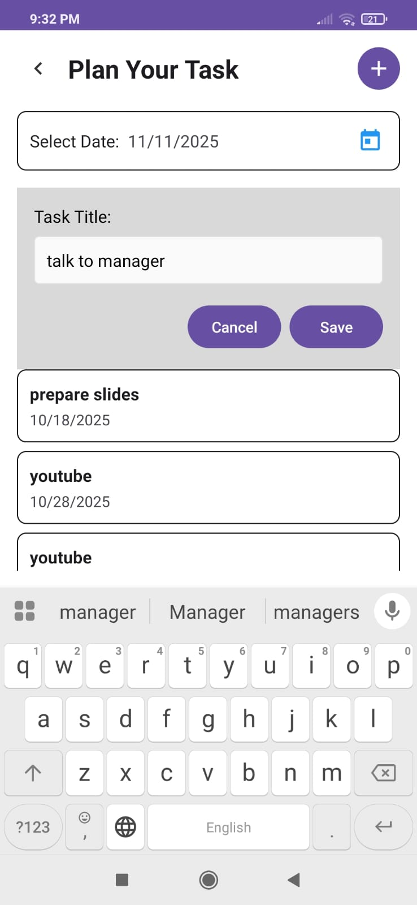
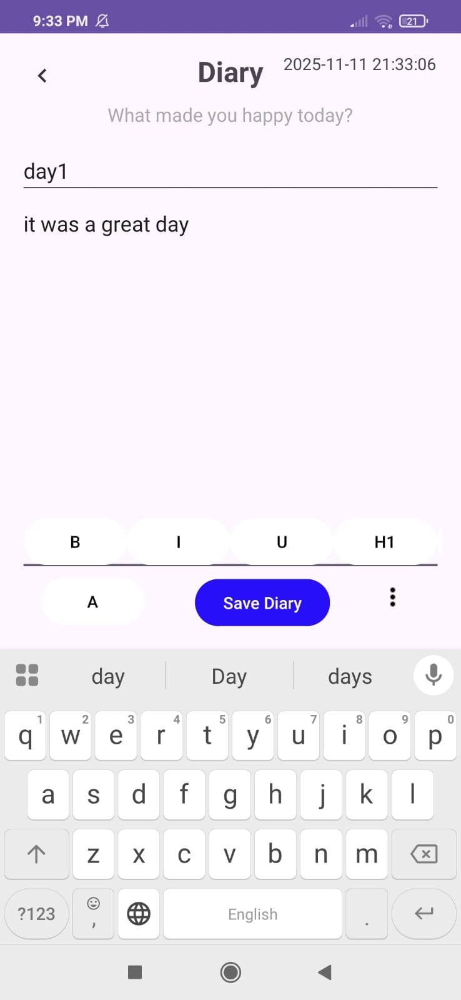
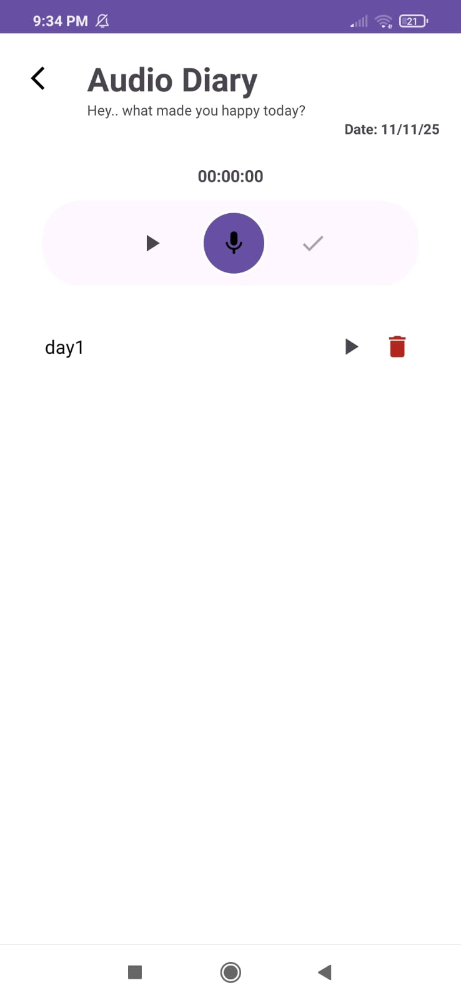
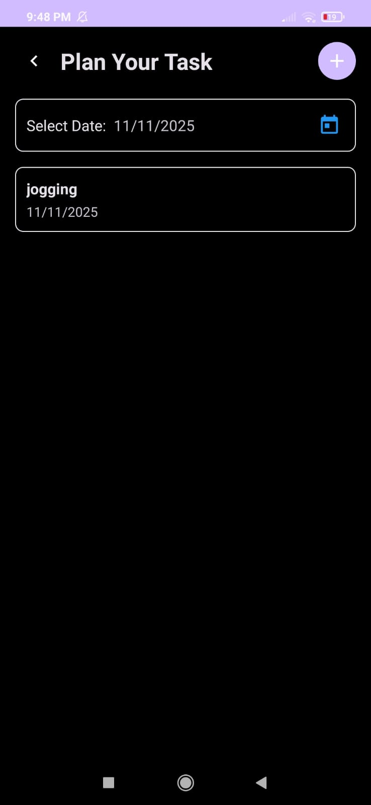

# 📔 PlannerAndDiary

PlannerAndDiary is an Android app designed to help users plan their daily activities, keep notes, and organize their schedules efficiently — all in one place.

---

## 🚀 Features

## 🔐 Authentication Screens
The app includes secure authentication using **Firebase Firestore**:
- **Login** and **Register** pages
- **Forgot Password** feature (sends reset link to registered email)

### 📊 Dashboard
- Today's tasks at a glance
- Quick search functionality
- Real-time task status updates
- Guest mode support

### 📝 Daily Diary
- Rich text editing with formatting options
- Save, edit, and delete diary entries
- Share entries with other apps
- Timestamp tracking
- Firebase Firestore integration

### 📅 Task Planner
- Calendar-based task management
- Add, modify, and delete tasks
- Set reminders for tasks
- Date-wise task organization
  

### 🎯 Habit Tracker
- Track daily habits
- Streak counting with fire emoji
- Mark habits as complete
- Persistent habit data

### 🎤 Audio Diary
- Record voice notes
- Play back recordings
- Delete audio entries
- Material Design audio controls

### 📈 Progress Analytics
- Task completion statistics
- Visual progress charts
- Most productive day tracking
- Completion rate calculation
  

### 🔔 Reminders

- Toggle reminders on/off
- Notification integration

### 🎨 Personalization
- Dark mode toggle
- Custom background colors

---

## 🛠️ Built With

- **Android Studio**
- **Java**
- **XML (UI Design)**
- **Firestore Database** 

---

## 📱 Installation

1. Go to the [Releases](https://github.com/dhanyashree-mit/PlannerAndDiary/releases) section.
2. Download the latest `.apk` file.
3. Install it on your Android device.
4. Open the app and start planning your day! ✨

---

## 📸 Screenshots

| Login Screen | Register | Dashboard  | Task Planner| Diary |  Audio Diary | Dark Mode | 
|--------------|----------|------------|-------------|-------|--------------|----------|
|  |  |  |  |   |   | 

---

## 👩‍💻 Author

**Dhanyashree Bhat**  

---

